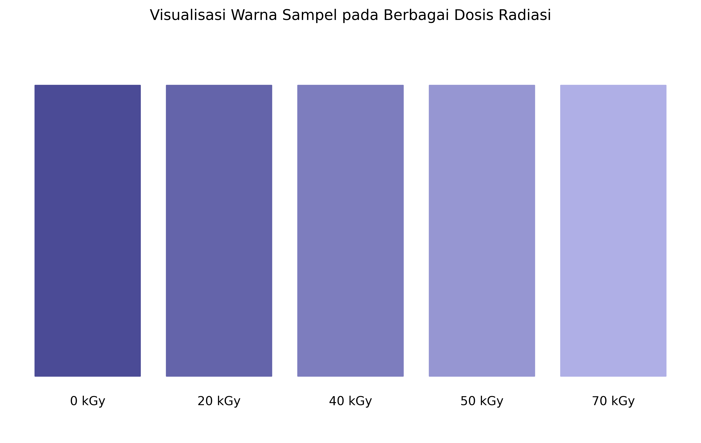

# spektrum-visualisasi
# Visualisasi Warna Film Dosimeter



## Deskripsi
Visualisasi ini menunjukkan perubahan warna film dosimeter berbasis Ethyl Violet-Bromophenol Blue yang didoping pada Poly(Vinyl Alcohol) [(EV-BPB)/PVA] pada berbagai dosis radiasi. Data visualisasi ini diadaptasi dari penelitian "Dosimeter Film Based on Ethyl Violet-Bromophenol Blue Dyed Poly(Vinyl Alcohol)" sebagai bagian dari pengembangan prototipe film dosimeter untuk sistem pembacaan dosimeter menggunakan scanner.

## Detail Visualisasi
- Rentang dosis: 0 - 70 kGy
- Interval pengukuran: 0, 20, 40, 50, dan 70 kGy
- Perubahan warna: dari ungu kebiruan pekat ke ungu kebiruan pudar seiring peningkatan dosis radiasi
- Berdasarkan data spektrum absorbansi dengan puncak di sekitar 600 nm

## Karakteristik Perubahan Warna
1. 0 kGy: Warna paling pekat (absorbansi ~1.2)
2. 20 kGy: Mulai memudar (absorbansi ~1.0)
3. 40 kGy: Pemudaran sedang (absorbansi ~0.8)
4. 50 kGy: Pemudaran lanjut (absorbansi ~0.7)
5. 70 kGy: Warna paling pudar (absorbansi ~0.6)

## Penggunaan
Visualisasi ini dapat digunakan sebagai referensi warna untuk:
- Kalibrasi sistem pembacaan dosimeter
- Verifikasi perubahan warna film dosimeter
- Estimasi dosis radiasi berdasarkan perubahan warna

## Kode Visualisasi
Kode Python untuk membuat visualisasi tersedia di file `visualisasi.py`. Untuk menjalankan kode:
1. Pastikan Python dan library yang diperlukan sudah terinstal:
   ```bash
   pip install matplotlib numpy
